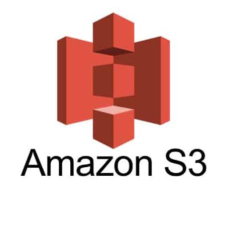
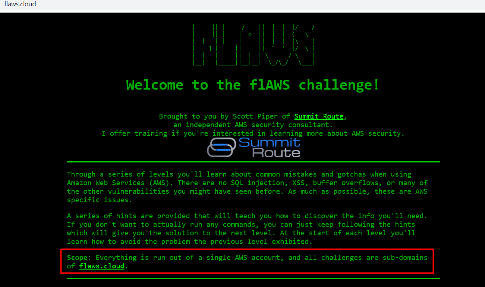
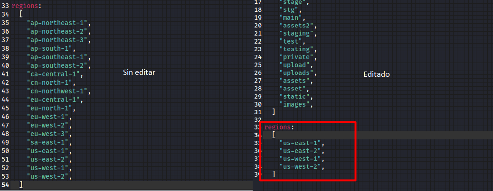
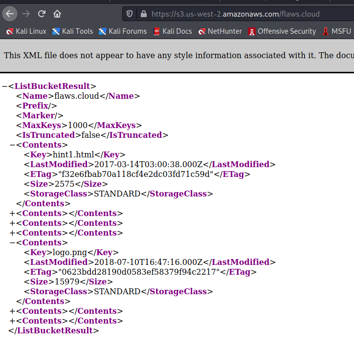
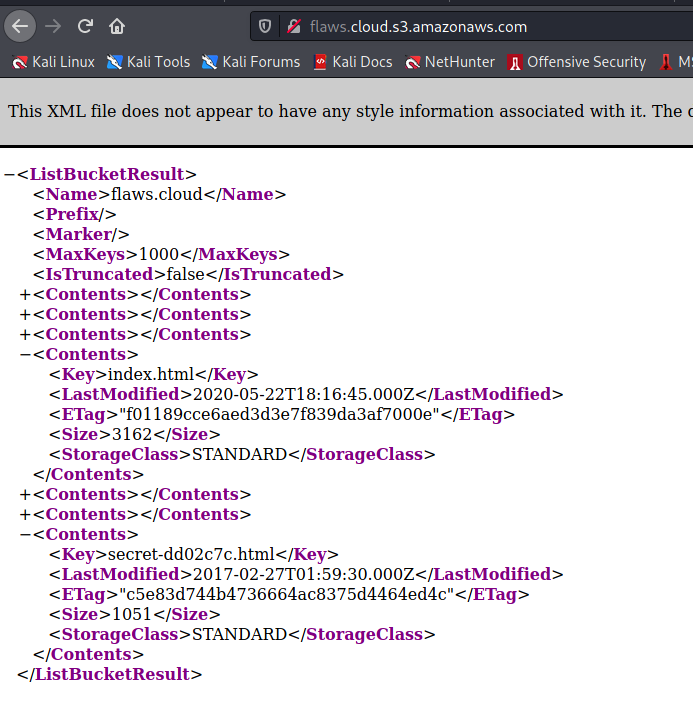
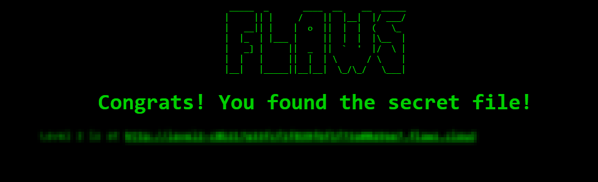

# Configuraciones incorrectas de seguridad en buckets S3 - Parte 1



### Introduccion

Las pruebas de penetración son el proceso de realizar pruebas de seguridad ofensivas en un sistema, servicio o red para encontrar debilidades de seguridad en él. Por lo tanto, cuando se trata de la penetración en la nube, es solo una prueba de penetración de sus servicios en la nube.

Los diferentes tipos de pruebas de penetración en la nube incluyen:

**Pruebas de penetración caja negra:** Simulación de ataques en la que los pentesters  no tienen conocimiento previo ni acceso a los sistemas en la nube.

**Pruebas de penetración caja gris:** Los pentester tienen un conocimiento limitado de los usuarios y los sistemas y se les pueden otorgar algunos privilegios de administración limitados.

**Pruebas de penetración caja blanca:** A los pentester se les concede acceso a nivel de administrador o root a los sistemas en la nube para poder realizar la verificacion de estos.

### S3

Amazon S3 (Simple Storage Service) ofrece un servicio de almacenamiento a través de interfaces de servicios web como REST. Puedes almacenar cualquier objeto en S3 incluyendo imágenes, videos, archivos, etc. Los objectos son organizados en buckets y pueden ser identificados dentro de cada bucket con una única llave asignada de usuario.

### Configuraciones incorrectas de seguridad:


Las configuraciones erróneas de seguridad son controles de seguridad que se configuran incorrectamente o se dejan inseguros, lo que pone en riesgo sus sistemas y datos. Básicamente, cualquier cambio de configuración mal documentado, configuración predeterminada o un problema técnico en cualquier componente podría provocar una configuración incorrecta.

### Ejemplos de configuraciones erróneas de S3

1. Acceso público a buckets de S3
2. No utilizar el cifrado del lado del servidor para las claves de cifrado administradas por S3
3. No cifrar el tráfico de datos entrantes y salientes de S3
4. No está familiarizado con cómo funciona el control de versiones de S3 o las políticas de ciclo de vida de S3
5. Configuración incorrecta de DNS (Subdomain Takeover)

### Nota

Paras las personas que aun no tienen los conceptos basicos sobre AWS S3 u otros temas que vamos estar viendo en este post, adjuntare algunos enlaces para que se complementen.

1. [Ingles - Amazon S3 Access Control - IAM Policies, Bucket Policies and ACLs](https://www.youtube.com/watch?v=xFzJw6wJ8eY).
2. [Regiones, zonas de disponibilidad y Local Zones](https://docs.aws.amazon.com/es_es/AmazonRDS/latest/UserGuide/Concepts.RegionsAndAvailabilityZones.html).
3. [Buckets overview](https://docs.aws.amazon.com/AmazonS3/latest/userguide/UsingBucket.html).

### Reconocimiento

Para la realizar este ejercicio vamos estar utilizando la web vulnerable por defecto [http://flaws.cloud](http://flaws.cloud).



Cuando se crea un buckets de S3 estos se alojan en diferentes regiones de AWS, siendo el valor predeterminado "US-East". El cliente S3A se envía a esta región de forma predeterminada, emitiendo solicitudes HTTP al servidor s3.amazonaws.com. Este punto de enlace central se puede utilizar para acceder a cualquier bucket en cualquier región que admita el uso de la API de autenticación V2.

Con esta informacion podemos realizar la enumeracion de buckets, pero como podemos hacer esto. Como alcance tenemos el nombre de la organizacion "flaws.cloud" o "flaws" los cuales podemos utilizar con diferentes herramientas para que nos identifique si existe un bucket con este nombre y si se encuentra de manera publica.

### Lazys3

Un script ruby para realizar fuerza bruta a buckets s3 que utiliza diferentes permutaciones basado en el nombre de nuestro activo que le pasemos como parametro. Esta herramienta realizada las peticiones al servidor s3.amazonaws.com.

Uso:

```bash
┌──(kali㉿kali)-[~/aws/]
└─$ git clone https://github.com/nahamsec/lazys3 && cd lazys3     
Cloning into 'lazys3'...
remote: Enumerating objects: 22, done.
remote: Total 22 (delta 0), reused 0 (delta 0), pack-reused 22
Receiving objects: 100% (22/22), 4.94 KiB | 361.00 KiB/s, done.
Resolving deltas: 100% (3/3), done.
```
```bash
┌──(kali㉿kali)-[~/aws/lazys3]
└─$ chmod +x lazys3.rb
┌──(kali㉿kali)-[~/aws/lazys3]
└─$ ./lazys3.rb flaws.cloud
Generated wordlist from file, 9013 items...
Found bucket: flaws.cloud (200)
Found bucket: flaws.cloud-admin.development (404)
Found bucket: flaws.cloud.admin.s3 (404)
Found bucket: flaws.cloud-administration.test (404)
Found bucket: flaws.cloud.administration.test (404)
```
<br>
### s3recon

Un script python para realizar fuerza bruta a buckets s3 que utiliza como parametro un diccionario realizado por nosotros. Esta herramienta realizada las peticiones a las diferentes regiones disposibles.

Uso:

```bash
┌──(kali㉿kali)-[~/aws/]
└─$ sudo pip install s3recon   
```
Diccionario utilizado:

```bash
┌──(kali㉿kali)-[~/aws/ctf]
└─$ cat wordlist.txt 
flaws
flaws.cloud
```
Con esta herramienta podemos espesificar a que regiones queremos que se aplique un ataque de fuerza bruta, como se ha habia mencionado al crear un bucket toma como valor prederminado US-East, en este caso le voy a espesificar a la herramienta que solo aplique ataque de fuerza bruta a la region de EU haciendo uso de archivo de configuracion .yml

```bash
┌──(kali㉿kali)-[~/aws/ctf]
└─$ locate s3recon.yml
/home/kali/.local/lib/python3.9/site-packages/s3recon/s3recon.yml
/usr/local/lib/python3.9/dist-packages/s3recon/s3recon.yml <-- vamos a editar este archivo.
└─$ sugo gedit /usr/local/lib/python3.9/dist-packages/s3recon/s3recon.yml
```



```bash
┌──(kali㉿kali)-[~/aws/ctf]
└─$ s3recon wordlist.txt                                                 
- PRIVATE https://s3.us-east-1.amazonaws.com/flaws.cloud
- PRIVATE https://s3.us-west-1.amazonaws.com/flaws.cloud
- PRIVATE https://s3.us-east-2.amazonaws.com/flaws
- PRIVATE https://s3.us-west-1.amazonaws.com/flaws
- PRIVATE https://s3.us-east-1.amazonaws.com/flaws
- PRIVATE https://s3.us-west-2.amazonaws.com/flaws
- PRIVATE https://s3.us-east-2.amazonaws.com/flaws.cloud
+ PUBLIC https://s3.us-west-2.amazonaws.com/flaws.cloud
Complete after: 0:08:02.040946
```
<br>
### s3scanner

Un script en pyton el cual nos permite analizar todos los permisos del bucket para encontrar configuraciones incorrectas, volcar el contenido de un bucket a una carpeta local si este se encuentra configurado de manera incorrecta.

Con las herramientas utilizadas anteriormente se ha descubierto que el nombre del bucket es: flaws.cloud

Uso:

```bash
┌──(kali㉿kali)-[~/aws/]
└─$ sudo pip install s3scanner   
```
Existen dos modos de uso de la herramienta:

Scanner: Verificar configuraciones incorrectas
Dump: Volcar el contenido de un bucket a una carpeta local

```bash
┌──(kali㉿kali)-[~/aws/ctf]
└─$ s3scanner scan --bucket flaws.cloud                                                                                                                                                                                                  2 
flaws.cloud | bucket_exists | AuthUsers: [], AllUsers: [Read]
```
La herramienta ha identificado que todos los usuarios tienen el permiso de lectura sobre los objectos que se encuentran deltro del bucket.

Para ingresar podemos hacerlo por medio de la direccion url identificada por medio de s3recon https://s3.us-west-2.amazonaws.com/flaws.cloud o por medio de la url global idenficada por lazys3.




### AWS-CLI

Es una herramienta unificada para administrar sus servicios de AWS por medio de consola.

```bash
sudo apt-get install awscli
```
Para listar los objectos del bucket s3 usaremos el siguiente comando.

```bash
┌──(kali㉿kali)-[~/…/blog/stuxctf.github.io/_blog/2021]
└─$ aws s3 ls s3://flaws.cloud --no-sign-request               
2017-03-13 23:00:38       2575 hint1.html
2017-03-02 23:05:17       1707 hint2.html
2017-03-02 23:05:11       1101 hint3.html
2020-05-22 14:16:45       3162 index.html
2018-07-10 12:47:16      15979 logo.png
2017-02-26 20:59:28         46 robots.txt
2017-02-26 20:59:30       1051 secret-dd02c7c.html
```

Con el paremetro --no-sign-request le espesificamos a la herramienta que no utilice ningun perfil creado de autenticacion para intertuar con el bucket, ahora unicamente queda abrir el archivo secret-dd02c7c.html.



Al entrar a la direccion url dentro del secret van observar una pequeña explicacion de la mala configuracion y el porque se genera esta.

**Vulnerabilidad Explotada:**  Bucket Público S3 Con Acceso 'LECTURA'	

**Bucket Vulnerable:** flaws.cloud

**Explicación de la vulnerabilidad:** Un bucket S3 configurado de manera READ (LIST) para todos todos, puede permitir a los usuarios anónimos enumerar los objetos dentro del bucket.

**Severidad:** Muy Alto (No tolerado)

Saludos
